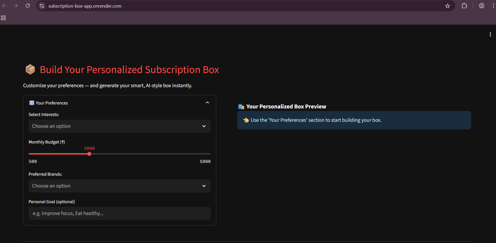

# 🎁 Hyper-Personalized Subscription Box Generator

A personalized product bundler that lets users build a curated subscription box based on their budget and lifestyle preferences.

## 🔗 Live App
[👉 View on Render](https://subscription-box-app.onrender.com)

## 💡 Features
- Monthly budget sliders
- Lifestyle and interest-based customizations
- Smart category builder

## 📸 Preview


## 🛠️ Tech Stack
- Python
- Streamlit
- JSON (for mock product database)
- Deployed on Render

## 🚀 Run Locally
```bash
git clone https://github.com/Shaurya-11011/Subscription-box-app.git
cd Subscription-box-app
pip install -r requirements.txt
streamlit run app.py
